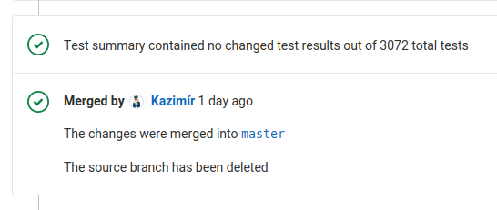
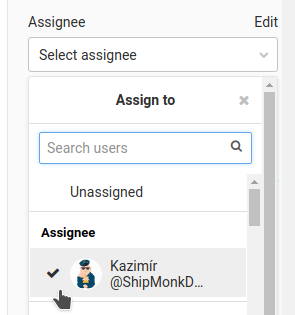
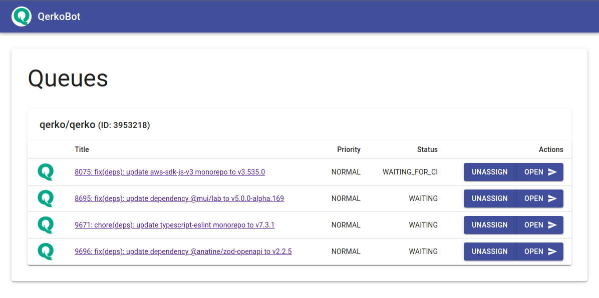

# GitLab merger bot


## What does it do?

The goal is to have green master after every merge. To achieve this, you have to rebase every single merge request just before a merge and wait for the pipeline status. It takes a lot of time to manually maintain, especially when you have to process multiple merge requests at once (common situation for large projects, monorepos etc.). So let's automate it with GitLab MergerBot.

1) When your merge request is ready to be merged, assign it to the bot.
2) The bot will add your request to its own serial (FIFO) queue. (single queue for every repository)
3) When your request is on the turn, the bot will rebase the MR and start waiting for the pipeline.
4) When the bot detects some problems with the merge request it'll reassign the merge request back to the author.<br />
Reasons can be for example:
	- Failing pipeline or pipeline waiting for a manual action
	- The merge request has unresolved discussions
	- The merge request can't be rebased due to a conflict

<p align="center">
	
	
	
</p>

### Advanced features

- Autogenerated commit message based on MR title (Suffixed with a link to the original MR).
- Blocking jobs are triggered automatically. Very useful for E2E testing etc.
- Bot skips squashing when the `bot:skip-squash` label is present on a MR.
- Bot assigns a MR to the start of the queue when the `bot:high-priority` label is present. This is useful for hotfixes etc.

## Pre-Installation requirements

#### Get the auth token

1) Create a new account for your bot-user
2) Sign-in to GitLab as the bot-user and go to [https://gitlab.com/profile/personal_access_tokens](https://gitlab.com/profile/personal_access_tokens)
3) Add new personal access token with the `api` scope

> We strongly recommend using a separate account for the bot-user. Don't reuse an existing account that can leave the project in the future.

#### Setup a GitLab repository

1) Make sure that your bot-user has privileges to accept merge requests
2) In the `General Settings - Merge Request` section:
	* set `Merge method` to `Fast-forward merge`
	* check `Only allow merge requests to be merged if the pipeline succeeds`
	* check (optionally) `All discussions must be resolved`


## Usage

#### Running in kubernetes (with HELM)

To add the Helm Chart for your local client, run helm repo add:

```bash
helm repo add gitlab-merger-bot https://pepakriz.github.io/gitlab-merger-bot
```

And install it:

```bash
helm install --name gitlab-merger-bot gitlab-merger-bot \
#	--set settings.gitlabUrl="https://gitlab.mycompany.com" \
	--set settings.authToken="<token>"
```

#### Running in docker

```bash
docker run -d --name gitlab-merger-bot --restart on-failure \
#	-e GITLAB_URL="https://gitlab.mycompany.com" \
	-e GITLAB_AUTH_TOKEN="<token>" \
	-v "$(pwd)/data":/data \
	pepakriz/gitlab-merger-bot:latest
```

#### Running as a plain JS app

```bash
yarn install
yarn run build
GITLAB_AUTH_TOKEN="<token>" yarn run start
```

#### Configuration options

| Env variable                   | Default value        |                                                                            |
|--------------------------------|----------------------|----------------------------------------------------------------------------|
| `GITLAB_URL`                   | `https://gitlab.com` | GitLab instance URL                                                        |
| `GITLAB_AUTH_TOKEN`            |                      | `required` Your GitLab token                                               |
| `ALLOWED_PROJECT_IDS`          | ``                   | It'll restrict operation only on selected projects. (comma separated list) |
| `HTTP_PROXY`                   | ``                   | Use HTTP proxy for API communication                                       |
| `CI_CHECK_INTERVAL`            | `10`                 | Time between CI checks (in seconds)                                        |
| `MR_CHECK_INTERVAL`            | `20`                 | Time between merge-requests checks (in seconds)                            |
| `REMOVE_BRANCH_AFTER_MERGE`    | `true`               | It'll remove branch after merge                                            |
| `SQUASH_MERGE_REQUEST`         | `true`               | It'll squash commits on merge                                              |
| `PREFER_GITLAB_TEMPLATE`       | `false`              | Use Gitlab template instead of custom message                              |
| `AUTORUN_MANUAL_BLOCKING_JOBS` | `true`               | It'll autorun manual blocking jobs before merge                            |
| `SKIP_SQUASHING_LABEL`         | `bot:skip-squash`    | It'll skip squash when MR contains this label                              |
| `HIGH_PRIORITY_LABEL`          | `bot:high-priority`  | It'll put MR with this label to the beginning of the queue                 |
| `SENTRY_DSN`                   | ``                   | It'll enable Sentry monitoring                                             |
| `HTTP_SERVER_ENABLE`           | `false`              | It'll enable experimental API and dashboard support                        |
| `HTTP_SERVER_PORT`             | `4000`               | It'll use different http server port                                       |
| `WEB_HOOK_TOKEN`               | ``                   | It'll enable experimental web hook support                                 |
| `ENABLE_PERMISSION_VALIDATION` | `false`              | It'll enable experimental permission validation                            |

## Development

For web hook development use this:

```bash
NGROK_AUTH=<authCode>
docker run -it --rm --net=host -p 4040:4040 -e NGROK_AUTH="$NGROK_AUTH" wernight/ngrok ngrok http 4000
```
